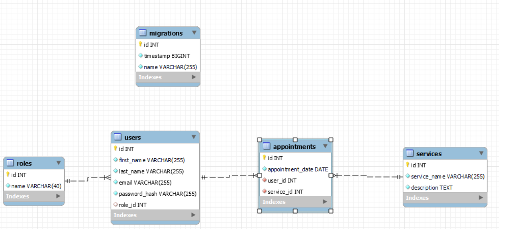
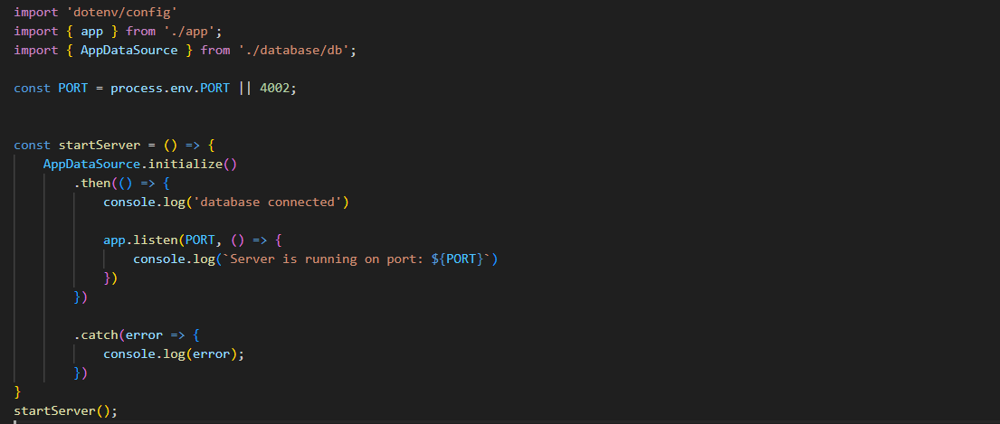
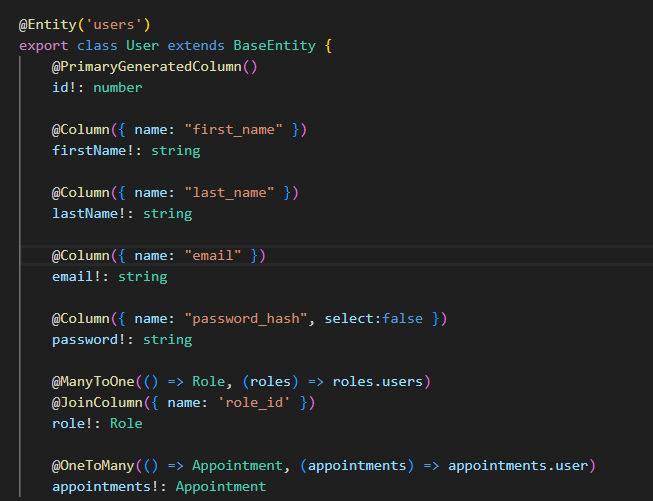
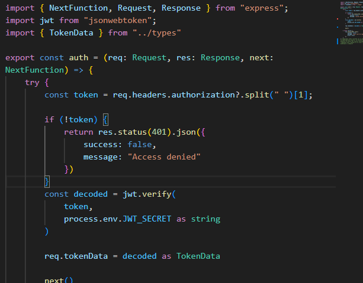
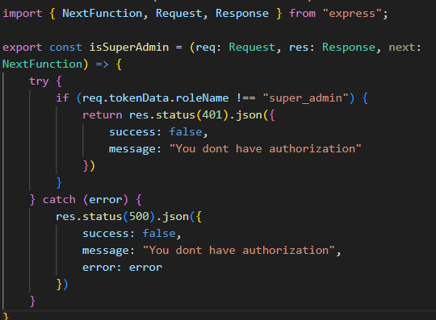
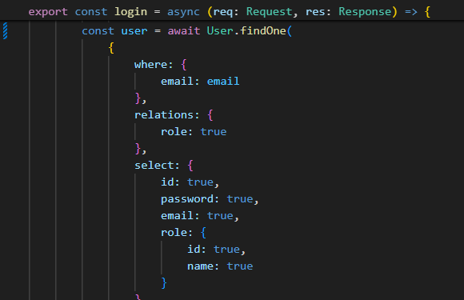
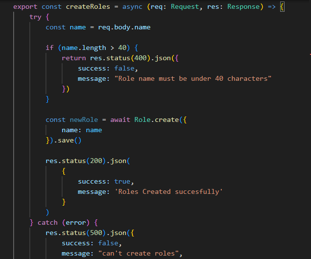
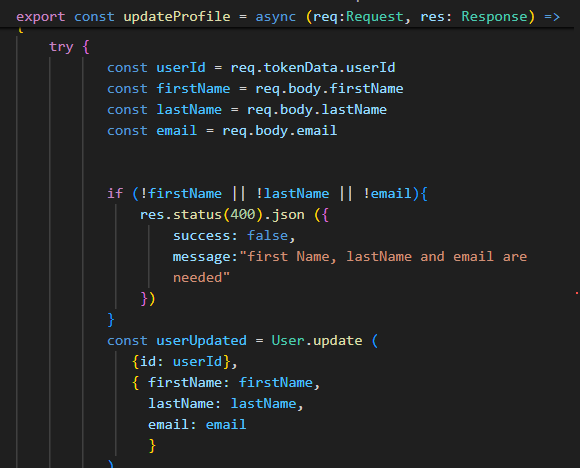
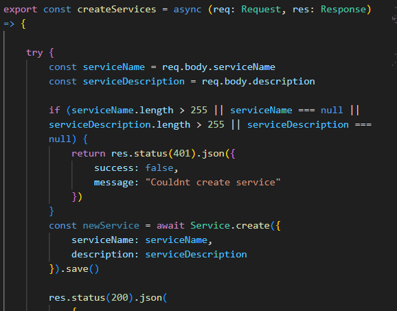
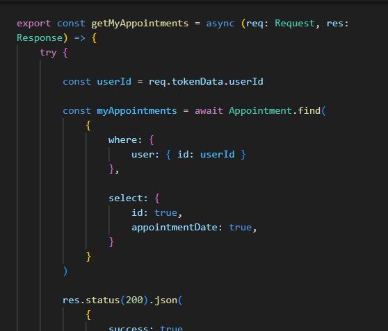

# API TATTOO WEB

### OBJETIVO :dart:
Este proyecto tiene como fin recrear el backend de una API con varias tablas de registros y relaciones de uno a muchos y viceversa entre ellas.

### TABLE OF CONTENTS :open_file_folder: 
- [API TATTOO WEB](#api-tattoo-web)
    - [OBJETIVO :dart:](#objetivo-dart)
    - [TABLE OF CONTENTS :open\_file\_folder:](#table-of-contents-open_file_folder)
    - [STACK :wrench:](#stack-wrench)
    - [SOBRE LA API :blue\_book:](#sobre-la-api-blue_book)
    - [DIAGRAMA BD :clipboard:](#diagrama-bd-clipboard)
    - [HOW TO TRY AND VISUALIZE IT :mag:](#how-to-try-and-visualize-it-mag)
    - [DISEÑO DE LA BASE DE DATOS :computer:](#diseño-de-la-base-de-datos-computer)
    - [AUTOR :pencil2:](#autor-pencil2)
    - [POTENTIAL IMPROVEMENTS :heavy\_check\_mark:](#potential-improvements-heavy_check_mark)
    - [ACKNOWLEDGMENTS :raised\_hands:](#acknowledgments-raised_hands)

### STACK :wrench:


### SOBRE LA API :blue_book:

Esta API permite crear un usuario con el que reservar citas para tatuajes o compra de productos del mundo del tattoo. Las posibilidades que brinda a los usuarios son:

-Registro de un nuevo usuario y login previo a la realización de cualquier acción con la web.
-Consulta sin necesidad de cuenta de los servicios que ésta ofrece
-Modificación de datos del usuario.
-Creación de citas para la asistencia al negocio además de la especificación del fin de la misma de entre los 5 servicios ofrecidos
-Consulta de citas pendientes del usuario o de citas concretas mediante su ID.
-Modificación de citas creadas previamente a fin de elegir una nueva fecha o servicio determinados.
-Consulta de servicios ofrecidos
-Consulta de todas las citas de los usuarios (super_admin)
-Creacion y consulta de roles para los usuarios (super_admin)
-Creación de nuevos servicios para la web (super_admin)

### DIAGRAMA BD :clipboard:

### HOW TO TRY AND VISUALIZE IT :mag: 

Aquí se encuentra enlace al repositorio del proyecto:
https://github.com/MR-ant1/Tattoo-API.git

Seguir los pasos descritos a continuación para preparar todo el entorno de la API:
<details>
<summary>INSTRUCCIONES</summary>
-1. Instalar Visual Studio Code, docker, algún cliente  y mysql workbrench en nuestro equipo. aqui dejo enlaces de descarga de docker y workbrench y un enlace a Postman, un ejemplo de cliente(también podemos añadir "Thunder Client desde las extensiones de visual studio code RECOMENDADO):
- <a href=https://www.docker.com/products/docker-desktop/ >Docker Desktop </a>
- <a href=https://downloads.mysql.com/archives/workbench/ > Mysql workbrench</a>
- <a href=https://www.postman.com/downloads/ > Postman</a>
- <a href=https://code.visualstudio.com/ > Visual studio Code</a>
-2. Abrimos windows powerShell e introducimos el siguiente comando para descargar la imagen de Mysql:
```hash 
docker pull mysql
```
seguido de este otro comando para establecer un contenedor con esa imagen. Detras de name, daremos el nombre que queramos al contenedor, despues de -p, estableceremos los puertos que usaremos (siendo el de la derecha el de nuestro equipo) y en ROOT y 1234, introduciremos nuestro usuario y contraseña para este contenedor.
``` hash
docker run --name mysql-container -p 3307:3306 -e MYSQL_ROOT_PASSWORD=1234 -d mysql
```

-3. Crearemos una carpeta para el proyecto, la abriremos y ejecutaremos en consola el comando: 
``` hash
git: init
```
Una vez lo hayamos hecho, Clonaremos el repositorio con el comando "git clone https://github.com/MR-ant1/Tattoo-API.git"
-4. Abrir terminal y ejecutar en orden de aparición, los siguientes comandos:
``` bash
npm init --y
```
``` bash
npm install
```
-5. Crear archivo ".env". Usar el sample incluido con las referencias necesarias para introducir nuestros datos de contenedor y poder levantar el servidor. Dejo un ejemplo de configuración:
``` bash
PORT=4001

DB_USER=rooT
DB_PASSWORD=1234
DB_PORT=3306
DB_HOST=localhost
DB_DATABASE=TATTOO

JWT_SECRET=SECRETO
```
-6. Crear base de datos en workbrench con el nombre igual al establecido en el archivo ".env" e importar la colección de endpoints a nuestro client. Esta se encuentra guardada en la carpeta HTTP
-7. Ejecutar migraciones mediante el comando:
``` bash
typeorm-ts-node-commonjs migration:run -d ./src/database/db.ts
```
Ésto enviará a nuestra base de datos el formato de nuestras tablas y sus relaciones
-8. Ejecutamos los seeders mediante el comando:
``` bash
ts-node ./src/database/seeders/seeder.ts
```
Con este comando añadiremos la información con los registros a nuestro mysql
-9. Levantamos servidor mediante el comando "npm run dev"
-10. Dirigirnos a nuestro client (thunderClient, insomnia, postman...) e importar el archivo de colecciones que incluye esta repositorio.
-11. Ya puedes probar las diferentes funciones del proyecto! mas abajo encontrarás toda la info sobre su funcionamiento.
</details>


### DISEÑO DE LA BASE DE DATOS :computer:

En primer lugar, se llevó a cabo la creación de una variable "app" que relacionaremos con express para posibilitar el funcionamiento del servidor. 
```
export const app: Application = express();

app.use(express.json());
```
Esta variable es definida y puesta en marcha justo debajo. Lo siguiente fue crear el archivo db.ts, donde definimos appDataSource, que contiene todos los datos asociados a nuestra base de datos y sus relaciones con migraciones y modelos
```
export const AppDataSource = new DataSource({
    type: "mysql",
    host: process.env.DB_HOST || "localhost",
    port: Number(process.env.DB_PORT) || 3306,
    username: process.env.DB_USER || "root",
    password: process.env.DB_PASSWORD || "",
    database: process.env.DB_DATABASE || "test",
    entities: [Role, User, Service, Appointment],
    migrations: [Roles1708976565121, Users1708977244413, Services1708980299717, Appointments1708980851262],
    synchronize: false,
    logging: false,
})
```
Como se puede ver viene preparado para funcionar sin tener que cambiarle ningun dato, ya que cuenta con el vínculo con ".env" y, en caso contrario, cuenta con unos parametros por defecto igualmente validos.

Desde aquí, se pasó a la elaboración de la función para levantar el servidor.

Aquí podemos ver como, importando la dependencia "dotenv", app-express y appDataSource mencionado arriba, ya pudimos definir la variable startServer, en la que inicializamos la base de datos. 
Justo despues, la aplicación de express deja en "escucha" al servidor, por lo que ya puede empezar a procesar ordenes. Abajo ya fuera de función, invocamos startServer para poder iniciar base de datos y servidor unicamente ejecutando la ruta de este "server.ts" Se añade nodemon a este comando para arrancar, de tal manera que éste le permitirá reiniciarse cada vez que se realice un guardado.
<details>
<summary>MIGRACIONES</summary>

A continuación se ejemplifica uno de los cuatro archivos que contienen las migraciones:

En el resto de casos, la estructura es exactamente similar a esta. Se exportó esta función que contiene el nombre de tabla y cada una de las columnas definidas para esta tabla servicios.
Estos documentos serán los que tomará como referencia nuestro mysql para elaborar las tablas de datos. Aqui decidiremos el tipo de dato que cada columna contendrá, y algunas propiedades de ser necesario para estas columnas como el no poder estar vacía, o su tamaño entre otras.
Además, indicaremos que columnas, si las hay, son foreign keys y van a tener relación con otras tablas, como se indica debajo:
```
   foreignKeys: [
                    {
                        columnNames: ["user_id"],
                        referencedTableName: "users",
                        referencedColumnNames: ["id"],
                        onDelete: "CASCADE"
                    },

                    {
                        columnNames: ["service_id"],
                        referencedTableName: "services",
                        referencedColumnNames: ["id"],
                        onDelete: "CASCADE"
                    }]
```
(columna "user_id", que viene referenciada de la tabla users y apunta a la columna id. el "ON CASCADE" evita que podamos manipular tablas que guarden relación con esta foreign key aunque ésta no pertenezca como tal. Lo mismo con service_id justo debajo)

Después de establecer las migraciones, el siguiente paso es crear los modelos o entidades que conectan estas tablas con los controllers y endpoints que después definiremos.
A continuación encontramos el modelo de usuarios que rige todas las interacciones que esta tendrá después con las demás tablas. Definimos el nombre de la tabla junto a entity, para posteriormente ir incluyendo las columnas id como primary key (la que enlazará con otras tablas) y las demas columnas secundarias. 

Las dos últimas que se aprecian, son de los dos tipos de relación utilizados en este proyecto, onetoMany y ManyToOne, al ser role_id una foreign_key de roles, una tabla mas fuerte que Users.
En caso contrario, tenemos appointments al ser Users mas fuerte y haber una columna "user_id" en appointments



Tanto migraciones como Entidades o modelos, deben ser referenciados en nuestro AppDataSOurce para que éste cree el vínculo que nos permita llevar a cabo el siguiente paso. Muestro captura del mismo archivo donde se encontraban nuestro AppDataSource, pero ahora con todas las migraciones y modelos tanto importados al archivo, como introducidos en su apartado de AppDataSource.

</details>
<details>
<summary>MIDDLEWARES</summary>

Sirven para controlar el acceso de usuarios a distintas funciones, se crearon dos middlewares "isSuperAdmin" y "auth" encargados de dar acceso a las funciones super_admin y comprobar que el usuario ha hecho login respectivamente
Las variables de ambos middlewares serán llamadas en las rutas de los distintos endpoints de ser necesarios para limitar o verificar al usuario que la solicite.

    AUTH
    
  Se define la variable auth, que usará los parametros req y res, y además NextFunction, que regula el paso a la siguiente función.
  Despues ya dentro de función, definimos la variable token, que comprobará si la cifra introducida es correcta eliminando mediante split las comillas que incluimos. Después utiliza el token y comprueba mediante la dependencia jwt, si el susodicho concuerda junto a la palabra secreta almacenada en .env .Si es, así da paso a la ejecución de isSuperAdmin si está presente, o a la variable del endpoint para que se ejecute.

    IS_SUPER_ADMIN

Comprueba si el rolename asociado al user_id del token, es super_admin y da acceso al endpoint limitado a dicho rol.
</details>

<details>
<summary>ENDPOINTS</summary>
<details>
<summary>AUTH ENDPOINTS</summary>
- Registration: 

No se muestra toda la función del controlador, pero en una primera parte, importamos Request y Response de express junto al modelo de User y definimos la función en la que pediremos los datos del nuevo usuario por el body. 
Una vez introducidos, se llevan acabo validaciones sobre el formato y el tamaño de los datos y se trata la contraseña para encriptarla mediante bcrypt. Este endpoint sustituye en si mismo a la función de crear usuarios que a priori se pensaba incluir en "userControler"
Para llevar a cabo este endpoint, iremos anuestro client y mediante el metodo POST, añadiremos la ruta asociada al registro:
localhost:PORT/api/auth/register.
Donde localhost se usa al ejecutarse en local, y PORT representa el puerto introducido en el archivo .env que ocupa la base de datos.
Si importamos la colección que adjunto en la carpeta HTTP, deberían venir todo preparado y solo hará falta cambiar el puerto de ser distinto al que ahi vendrá.
Tras esto, iremos a la pestaña "Body", en introduciremos en el cuadro inferior de texto las 4 columnas a crear del usuario con sus valores donde aparecen las "x" tal y como vienen escritas aqui respetando comillas:
``` bash
{
  "firstName": "xxxxx",
  "lastName": "xxxxxxx",
  "email": "xxxxxxxxx",
  "password": "xxxxxx"
}
```

- Login:
  
 Con login volvemos a saltar la primera parte. Se aprecia arriba de la imagen como se define la función usando request y response, después se piden tanto email como contraseña por body y, tras dos validaciones, se pasa a la parte que se ilustra.

 Se hace una búsqueda de un solo usuario que tenga ese mismo email (no puede haber dos usuarios con un mismo email), y se obtienen sus datos mediante select. 
 
 
 Tras esto, se hace una comparación mediante bcrypt con la contraseña almacenada (este se encarga de desencriptarla) y por último, se lleva a cabo la creación de un token temporal para ese usuario con jwt, importado arriba del documento. Le indicamos aqui que contendrá tanto el user_id como el rol del usuario loggeado.Y en el archivo aparte "types>index",
 ```
export interface TokenData {
    userId: number;
    roleName: string;
};

declare global {
    // Express
    namespace Express {
        export interface Request {
            tokenData: TokenData;
        }
    }
}
 ```
damos formato a la función de token creada en el login.
Este token será el que se use a partir de ahora para autentificar a cualquier usuario como perteneciente a la base de datos.
Para hacer funcionar esta endpoint, debemos de nuevo acudir al body de nuestro client, y con mediante el metodo post y la ruta:
- localhost:PORT/api/auth/login
 client, y consultar algun correo de algún usuario randomizado, aunque se recomienda usar el el correo con derechos de super_admin junto a la contraseña indicada(todos los usuarios randomizados y admin, tienen la misma contraseña por defecto)
 ``` bash
 "email": "superadmin@superadmin.com",
 "password": "useruser"
```
COPIAREMOS EL NUMERO DE TOKEN QUE LA CONSOLA DEL CLIENT DEVUELVA PARA, A PARTIR DE AHORA, UTILIZARLO EN NUESTRO CLIENT INTRODUCIENDOLO EN EL APARTADO AUTH>BEARER
</details>
<details>
<summary>ROLES ENDPOINTS</summary>
    GET ROLES (super_admin): GET -> localhost:PORT/api/roles
Obtendremos como super admins la posibilidad de consultar todos los roles disponibles para los usuarios. Por defecto: user, admin y super_admin

    CREATE ROLES (super_admin): POST -> localhost:PORT/api/roles
    
Podremos crear nuevos roles para la BD(base de datos), necesitaremos introducir la columna "name" con su valor en el body como veniamos haciendo anteriormente mas el token que guardamos al loggear
</details>
<details>
<summary>USER ENDPOINTS</summary>
    GET USERS (super_admin): GET -> localhost:4001/api/users?limit=2&page=2
Este endpoint nos traerá a todos los usuarios. La ruta varía respecto a los demas dado que en este hemos añadido un limitador de usuarios por página a mostrar para evitar largas listas en casos de muchos registros. Se pueden manipular las cifras tras limit y page para modificar el numero de registros por pagina y la pagina en la que situarse. Puede quitarse la elección de pagina

     GET USERS BY ID (super_admin): GET -> localhost:PORT/api/users/id
Podremos obtener los datos de un usuario concreto. Pondremos el numero de de id del usuario en lugar del "id" de la ruta para indicar cual buscamos.
     CREATE USERS (super_admin): POST -> localhost:PORT/api/users
Añadir nuevos usuarios a la BD. Tendremos que introducir en el body de nuestro client, los siguientes registros con nuestra elección para cada uno. tambien el token en auth>bearer, como en todos los endpoints salvo login y register:
``` bash
{
    "firstName": "xxxxxxx",
    "lastName": "xxxxxxxx",
    "email": "xxxxxx@xxx.xxx",
    "password": "xxxxxxx"
}
```
    GET PROFILE: GET -> localhost:PORT/api/users/profile
Obtener los datos de la propia cuenta logueada. Utilizará el token asignado para identificar al dueño de la petición.

    UPDATE PROFILE: PUT -> localhost:PORT/api/users/profile
    
De nuevo, mediante la identificación por token, obtendremos el usuario que realiza petición y, mediante body, le introduciremos los registros y valores nuevos para nuestro usuario. Los introduciremos de la misma forma que explicamos en Register y en CREATE USERS.

</details>
<details>
<summary>SERVICES ENDPOINTS</summary>
    
    GET SERVICES (open): GET localhost:PORT/api/services
Este es el único endpoint abierto a todo usuario incluso sin registro. Mostrará los ervicios disponibles en el negocio. No precisa de token al no tener que autentificar
    
    CREATE SERVICES (super_admin): POST localhost:PORT/api/services
Podremos crear nuevos servicios para mostrar a lo usuarios.

</details>
<details>
<summary>APPOINTMENTS ENDPOINTS</summary>

    GET MY APPOINTMENTS: GET localhost:PORT/api/appointments
Mediante la identificación por token, el sistema mostrará todas las citas asocidas al usuario que lo solicita.
    

    GET AN APPOINTMENT: GET localhost:PORT/api/appointments/id
Buscar una cita concreta mediante su número de id al final de la ruta superior (sustituyendo a "id")
   
    CREATE APPOINTMENTS: POST localhost:PORT/api/appointments
Mediante la identificación por token, el sistema creará una nueva cita para el usuario. Solo necesitara que introduzcamos por body del client los campos "appointmentDate" y "serviceId" como veniamos haciendo, para seleccionar la fecha y hora y el servicio que consumiremos. IMPORTANTE. introducir la fecha en formato YYYY-MM_DD HH-MM-SS
   
    UPDATE APPOINTMENT: PUT localhost:PORT/api/appointments
Actualizar la hora o servicio seleccionado de una cita concreta. Introduciremos en el body los campos "id", "appointmentDate" y "serviceId" como en anteriores endpoints con sus nuevos valores.

</details>


</details>
### AUTOR :pencil2:
- Antonio Rodrigo - Full Stack Developer student

- <a href="https://github.com/MR-ant1">GitHub - <a>Linkedin</a>

### POTENTIAL IMPROVEMENTS :heavy_check_mark: 

-En el futuro se podrían implementar mas funciones como borrar usuarios, roles o citas.
-Podría mejorarse algún endpoint añadiendole mas información a devolver para mejorar la accesibilidad y manejo del programa.

### ACKNOWLEDGMENTS :raised_hands:

Muchísimas gracias como siempre al equipo de GeeksHubs Achademy por brindarme esta posibilidad de desarrollarme en el mundo y a todos mis compañeros que siempre están ahi para echar una mano cuando hace falta!

[def]: #Acknowledgments-

:arrow_up: [Table-of-contents](#table-of-contents-open_file_folder)