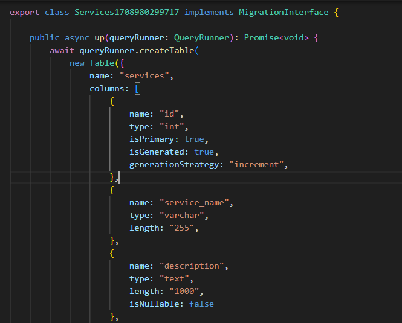
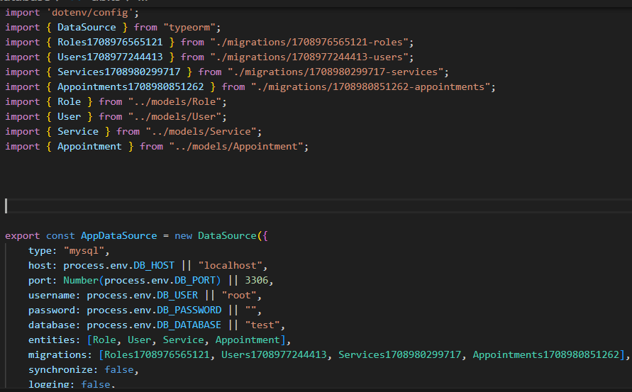
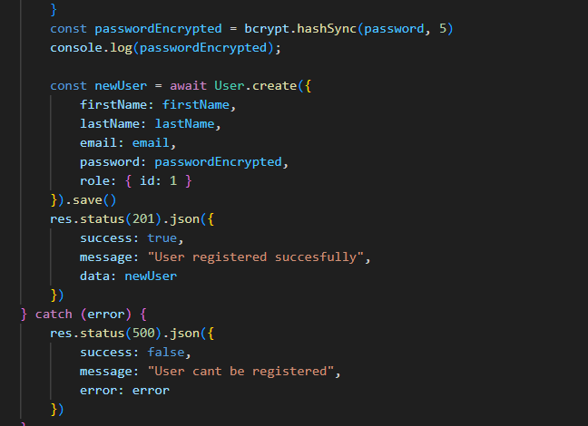
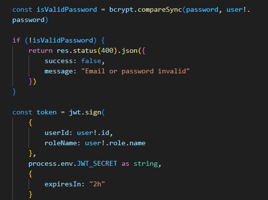

# API TATTOO WEB

### OBJETIVO
Este proyecto tiene como fin recrear el backend de una API con varias tablas de registros y relaciones de uno a muchos y viceversa entre ellas.

### TABLE OF CONTENTS :open_file_folder: 
- [API TATTOO WEB](#api-tattoo-web)
    - [OBJETIVO](#objetivo)
    - [TABLE OF CONTENTS :open\_file\_folder:](#table-of-contents-open_file_folder)
    - [STACK :wrench:](#stack-wrench)
    - [SOBRE LA API](#sobre-la-api)
    - [DIAGRAMA BD](#diagrama-bd)
    - [HOW TO TRY AND VISUALIZE IT :mag:](#how-to-try-and-visualize-it-mag)
    - [DISEÑO DE LA BASE DE DATOS :computer:](#diseño-de-la-base-de-datos-computer)
    - [AUTHOR :pencil2:](#author-pencil2)
    - [POTENTIAL IMPROVEMENTS :heavy\_check\_mark:](#potential-improvements-heavy_check_mark)
    - [ACKNOWLEDGMENTS :raised\_hands:](#acknowledgments-raised_hands)

### STACK :wrench:


### SOBRE LA API

Esta API permite crear un usuario con el que reservar citas para tatuajes o compra de productos del mundo del tattoo. Las posibilidades que brinda a los usuarios son:

-Registro de un nuevo usuario y login previo a la realización de cualquier acción con la web.
-Consulta sin necesidad de cuenta de los servicios que ésta ofrece
-Modificación de datos del usuario.
-Creación de citas para la asistencia al negocio además de la especificación del fin de la misma de entre los 5 servicios ofrecidos
-Consulta de citas pendientes del usuario o de citas concretas mediante su ID.
-Modificación de citas creadas previamente a fin de elegir una nueva fecha o servicio determinados.
-Consulta de servicios ofrecidos
-Consulta de todas las citas de los usuarios (super_admin)
-Creacion y consulta de roles para los usuarios (super_admin)
-Creación de nuevos servicios para la web (super_admin)

### DIAGRAMA BD

### HOW TO TRY AND VISUALIZE IT :mag: 

Aquí se encuentra enlace al repositorio del proyecto:
https://github.com/MR-ant1/Tattoo-API.git

Seguir los pasos descritos a continuación para preparar todo el entorno de la API:

-1. Clonar repositorio con el comando "git clone https://github.com/MR-ant1/Tattoo-API.git"
-2. Abrir terminal y ejecutar el comando npm install.
-3. Crear archivo ".env". Usar el sample incluido con las referencias necesarias para introducir nuestros datos de contenedor y poder levantar el servidor.
-4. Crear base de datos con el nombre igual al establecido en el archivo ".env"
-5 Ejecutar migraciones mediante el comando abreviado en el package json "npm run migrations-run"
-6. Ejecutamos los seeders mediante el comando guardado "npm run seed"
-7. Levantamos servidor mediante el comando "npm run dev"
-8. Dirigirnos a nuestro client (thunderClient, insomnia, postman...) e importar el archivo de colecciones que incluye esta repositorio.
-9. Ya puedes probar las diferentes funciones del proyecto! mas abajo encontrarás toda la info sobre su funcionamiento.


### DISEÑO DE LA BASE DE DATOS :computer:

En primer lugar, se llevó a cabo la creación de una variable "app" que relacionaremos con express para posibilitar el funcionamiento del servidor. 
```
export const app: Application = express();

app.use(express.json());
```
Esta variable es definida y puesta en marcha justo debajo. Lo siguiente fue crear el archivo db.ts, donde definimos appDataSource, que contiene todos los datos asociados a nuestra base de datos y sus relaciones con migraciones y modelos
```
export const AppDataSource = new DataSource({
    type: "mysql",
    host: process.env.DB_HOST || "localhost",
    port: Number(process.env.DB_PORT) || 3306,
    username: process.env.DB_USER || "root",
    password: process.env.DB_PASSWORD || "",
    database: process.env.DB_DATABASE || "test",
    entities: [Role, User, Service, Appointment],
    migrations: [Roles1708976565121, Users1708977244413, Services1708980299717, Appointments1708980851262],
    synchronize: false,
    logging: false,
})
```
Como se puede ver viene preparado para funcionar sin tener que cambiarle ningun dato, ya que cuenta con el vínculo con ".env" y, en caso contrario, cuenta con unos parametros por defecto igualmente validos.

Desde aquí, se pasó a la elaboración de la función para levantar el servidor.

Aquí podemos ver como, importando la dependencia "dotenv", app-express y appDataSource mencionado arriba, ya pudimos definir la variable startServer, en la que inicializamos la base de datos. 
Justo despues, la aplicación de express deja en "escucha" al servidor, por lo que ya puede empezar a procesar ordenes. Abajo ya fuera de función, invocamos startServer para poder iniciar base de datos y servidor unicamente ejecutando la ruta de este "server.ts" Se añade nodemon a este comando para arrancar, de tal manera que éste le permitirá reiniciarse cada vez que se realice un guardado.

MIGRACIONES
A continuación se ejemplifica uno de los cuatro archivos que contienen las migraciones:

En el resto de casos, la estructura es exactamente similar a esta. Se exportó esta función que contiene el nombre de tabla y cada una de las columnas definidas para esta tabla servicios.
Estos documentos serán los que tomará como referencia nuestro mysql para elaborar las tablas de datos. Aqui decidiremos el tipo de dato que cada columna contendrá, y algunas propiedades de ser necesario para estas columnas como el no poder estar vacía, o su tamaño entre otras.
Además, indicaremos que columnas, si las hay, son foreign keys y van a tener relación con otras tablas, como se indica debajo:
```
   foreignKeys: [
                    {
                        columnNames: ["user_id"],
                        referencedTableName: "users",
                        referencedColumnNames: ["id"],
                        onDelete: "CASCADE"
                    },

                    {
                        columnNames: ["service_id"],
                        referencedTableName: "services",
                        referencedColumnNames: ["id"],
                        onDelete: "CASCADE"
                    }]
```
(columna "user_id", que viene referenciada de la tabla users y apunta a la columna id. el "ON CASCADE" evita que podamos manipular tablas que guarden relación con esta foreign key aunque ésta no pertenezca como tal. Lo mismo con service_id justo debajo)

Después de establecer las migraciones, el siguiente paso es crear los modelos o entidades que conectan estas tablas con los controllers y endpoints que después definiremos.
A continuación encontramos el modelo de usuarios que rige todas las interacciones que esta tendrá después con las demás tablas. Definimos el nombre de la tabla junto a entity, para posteriormente ir incluyendo las columnas id como primary key (la que enlazará con otras tablas) y las demas columnas secundarias. 

Las dos últimas que se aprecian, son de los dos tipos de relación utilizados en este proyecto, onetoMany y ManyToOne, al ser role_id una foreign_key de roles, una tabla mas fuerte que Users.
En caso contrario, tenemos appointments al ser Users mas fuerte y haber una columna "user_id" en appointments


Tanto migraciones como Entidades o modelos, deben ser referenciados en nuestro AppDataSOurce para que éste cree el vínculo que nos permita llevar a cabo el siguiente paso. Muestro captura del mismo archivo donde se encontraban nuestro AppDataSource, pero ahora con todas las migraciones y modelos tanto importados al archivo, como introducidos en su apartado de AppDataSource.


  ENDPOINTS

- Registration: 

No se muestra toda la función del controlador, pero en una primera parte, importamos Request y Response de express junto al modelo de User y definimos la función en la que pediremos los datos del nuevo usuario por el body. 
Una vez introducidos, se llevan acabo validaciones sobre el formato y el tamaño de los datos y se trata la contraseña para encriptarla mediante bcrypt. Este endpoint sustituye en si mismo a la función de crear usuarios que a priori se pensaba incluir en "userControler"

- Login:
  
 Con login volvemos a saltar la primera parte. Se aprecia arriba de la imagen como se define la función usando request y response, después se piden tanto email como contraseña por body y, tras dos validaciones, se pasa a la parte que se ilustra.

 Se hace una búsqueda de un solo usuario que tenga ese mismo email (no puede haber dos usuarios con un mismo email), y se obtienen sus datos mediante select. 
 
 Tras esto, se hace una comparación mediante bcrypt con la contraseña almacenada (este se encarga de desencriptarla) y por último, se lleva a cabo la creación de un token temporal para ese usuario con jwt, importado arriba del documento. Le indicamos aqui que contendrá tanto el user_id como el rol del usuario loggeado.Y en el archivo aparte "types>index",
 ```
export interface TokenData {
    userId: number;
    roleName: string;
};

declare global {
    // Express
    namespace Express {
        export interface Request {
            tokenData: TokenData;
        }
    }
}
 ```
damos formato a la función de token creada en el login.
### AUTHOR :pencil2:
- Antonio Rodrigo - Full Stack Developer student

- <a href="https://github.com/MR-ant1">GitHub - <a>Linkedin</a>

### POTENTIAL IMPROVEMENTS :heavy_check_mark: 


### ACKNOWLEDGMENTS :raised_hands:

Big shout out to GeeksHubs for giving me the chance to learn about all this amazing world of developing
More and better proyects are coming nearly thanks to them!
Sorry for many possible mistakes in English but I'm training my writing skills and trying to learn technicalities from the area! :D

[def]: #Acknowledgments-

:arrow_up: [Table-of-contents](#table-of-contents-open_file_folder)